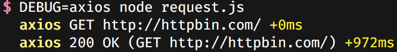

# axios-debug-log

Axios interceptor of logging requests &amp responses by [debug](https://www.npmjs.com/package/debug).

## Install 

    $ npm install --save axios axios-debug-log
    
## Node.js usage

1. Install: add `require('axios-debug-log')` before any axios execution.
2. Enable: set `DEBUG` environment variable to `axios` before start your fantastic Node.js application.

## Browser usage

1. Install: add `require('axios-debug-log')` before any axios execution.
2. Enable: set `localStorage.debug = "axios"` before start your fantastic web application.

Please read [README of debug](https://github.com/visionmedia/debug#readme) for usage details.

## License

MIT
